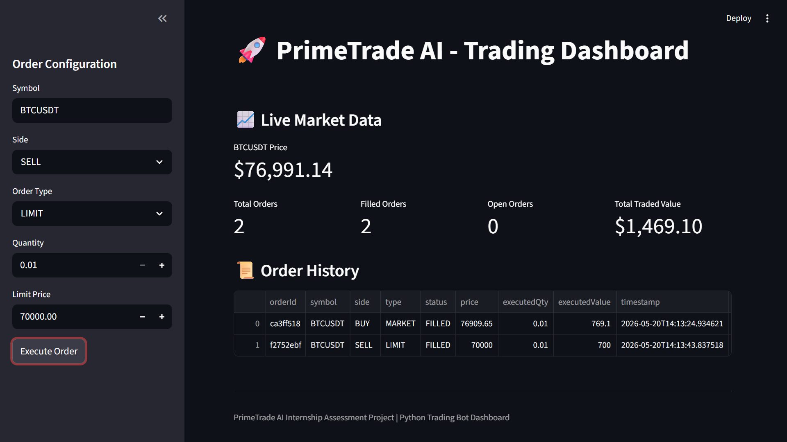

# PrimeTrade AI - Simulated Crypto Trading Bot

A professional Python-based crypto trading bot with live Binance market data integration, simulated order execution, CLI interaction, logging, validation, persistent order storage, and a lightweight frontend dashboard.

---

# Features

## Core Features
- Live Binance market price fetching
- MARKET order simulation
- LIMIT order simulation
- BUY and SELL support
- Real-time dashboard updates
- Persistent order history

## Engineering Features
- Structured backend architecture
- Input validation
- Custom exception handling
- API error handling
- JSON-based order persistence
- Structured logging system
- Professional CLI interface

## Frontend Features
- Streamlit trading dashboard
- Live market price display
- Trading metrics
- Order history table
- Interactive order placement form

---

# Project Architecture

```text
prime_trade_bot/
│
├── bot/
│   ├── api/
│   │   └── client.py
│   │
│   ├── services/
│   │   └── order_service.py
│   │
│   ├── utils/
│   │   ├── logger.py
│   │   ├── validators.py
│   │   └── storage.py
│   │
│   ├── config/
│   │   └── settings.py
│   │
│   └── exceptions/
│       └── custom_exceptions.py
│
├── data/
│   └── orders.json
│
├── logs/
│   └── trading_bot.log
│
├── app.py
├── cli.py
├── README.md
├── requirements.txt
└── .gitignore
```

---

# Technologies Used

- Python 3.11
- Streamlit
- Typer
- Rich
- Requests
- Pandas
- Binance Public API

---

# Installation

## Clone Repository

```bash
git clone <repository_url>
cd prime_trade_bot
```

---

## Create Virtual Environment

```bash
python -m venv venv
```

---

## Activate Virtual Environment

### Windows PowerShell

```bash
.\venv\Scripts\Activate.ps1
```

---

## Install Dependencies

```bash
pip install -r requirements.txt
```

---

# Running the Application

## Run Frontend Dashboard

```bash
streamlit run app.py
```

---

## Run CLI Interface

### MARKET Order

```bash
python cli.py --symbol BTCUSDT --side BUY --type MARKET --quantity 0.01
```

### LIMIT Order

```bash
python cli.py --symbol BTCUSDT --side SELL --type LIMIT --quantity 0.01 --price 70000
```

---

# Dashboard Features

The Streamlit dashboard includes:

- Live cryptocurrency market prices
- Market and limit order execution
- Order history tracking
- Trading metrics dashboard
- Auto-refreshing market updates

---

# Logging

Application logs are stored in:

```text
logs/trading_bot.log
```

Logs include:
- API requests
- API responses
- Order execution details
- Validation errors
- Runtime exceptions

---

# Validation & Error Handling

The application includes:

- Symbol validation
- Order type validation
- Quantity validation
- Price validation
- API exception handling
- Network failure handling
- Structured custom exceptions

---

# Persistent Storage

Orders are stored in:

```text
data/orders.json
```

This enables:
- Order history tracking
- Dashboard analytics
- Persistent state management

---

# Assumptions

Due to Binance Futures Testnet regional/API verification limitations, this project uses live Binance market data APIs alongside a simulated execution engine for safe testing and demonstration purposes.

---

# Screenshot

Frontend Dashboard:



---

# Author

Developed as part of a Python Developer internship assessment project.